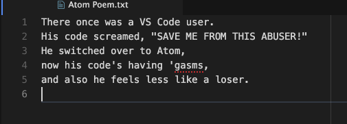

# text-align

An [Atom](https://atom.io) text editor package that supports left aligning,
centering, right aligning, and justification of text between the left side of
the editor and the Preferred Line Length setting.

## `text-align` in Action:

## Intended Use:

- This package aims to be useful when aligning items in documentation or any
  other text files, but you may find other uses for it.

## Commands Available:

- `left-align`    
- `center-align`
- `right-align`
- `justify`
- `dejustify`

## Rules:

- If no selection is made, text on the line of the cursor is aligned.  
- If a selection is made, all lines of text containing the selection
  will be aligned.
- Any blank lines will be ignored.
- Any lines exceeding the Preferred Line Length setting will be ignored when
  running any of the following commands:`left-align`, `center-align`,
  `right-align`, or `justify`.  Note, `dejustify` does not follow this rule.
